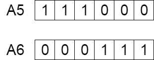

# Problema da Mochila com Algoritmos Genéticos

## O que são Algoritmos Genéticos ?

Algoritmos Genéticos são técnicas utilizadas para tarefas de busca e otimização, ou seja, a busca pelo ótimo, ou mais próximo disso o possível. Este algoritmo é inspirado na teoria da evolução, de Charles Darwin, ele reflete o processo de evolução natural onde os indivíduos mais adaptados são selecionados para reprodução e assim gerar uma próxima geração melhor que a anterior.

### Noção da seleção natural

O processo de seleção natural começa com a seleção dos indivíduos mais adaptados de uma população, estes devem gerar descendentes que irão herdar as características de seus pais e compor a próxima geração. Esse processo se repete até encontrar a geração "ótima".

Esta noção é aplicada para encontrar a melhor entre diversas soluções para um determinado problema.

Um algoritmo genético pode conter as seguintes etapas:

1. População inicial
2. Avaliação
3. Seleção de indivíduos
4. Cruzamento
5. Mutação
6. Condição de parada


## Descrição do problema

Você ficara isolado na natureza selvagem. A única coisa que poderá levar é uma mochila que suporta no máximo 30 kg. Você possui diversos itens de sovrevivência, cada um possui "pontos de sobrevivência" (dados para cada item de acordo com a tabela).
Seu objetivo é maximizar os pontos de sobrevivência.

|      Item      |Peso|Pontos|
|----------------|----|------|
| Saco de dormir | 15 |  15  |
| Corda          |  3 |   7  |
| Canivete       |  2 |  10  |
| Tocha          |  5 |   5  |
| Garrafa        |  9 |   8  |
| Comida         | 20 |  17  |

## Resolvendo o problema

No arquivo main.py resolvemos o problema definindo em dois arrays o peso e ponto de cada item, o limite de peso para uma mochila e o tamanho da população (intervalo de busca) para solucionar o problema.

https://github.com/Gabukuro/Knapsack/blob/bae7d8b149665e5885f5fbc6fee5c85ceca86745/main.py#L1-L9


### 1. População Inicial

O processo de evolução começa com um conjunto de indivíduos chamado população e cada indivíduo representa uma solução possível para o problema.

Um indivíduo é caracterizado por um conjunto de parâmetros conhecido como genes e estes genes aglomerados em uma string formam um cromossomo, uma solução.

Em algoritmos genéticos, o conjunto de genes de um indivíduo é representado por uma string, e geralmente valores binários são utilizados, ou seja, strings de 0 e 1. 


Dentro da classe KnapSackSolver, o método solve() dá início ao processo de seleção natural, gerando a população com a quantidade de membros que foi recebido como parâmetro pelo construtor da classe.

A classe População irá gerar de forma aleatória os indivíduos da primeira geração, ou seja, a única regra aplicada para essa geração é de que o máximo de peso não deve ser excedido.

```python
  # método solve dentro da classe KnapSackSolver

  def solve(self):

    self.population.initializePopulation(self.populationLength)

  ...

  # método initializePopulation dentro da classe population

  def initializePopulation(self, size):
    self.popSize = size
    for i in range(self.popSize):
      self.individuals.append(Individual())

  ...

  # construtor de population que irá gerar os cromossomos de maneira aleatória

  def __init__(self):
    self.weight = 0
    self.fitness = 0
    self.geneLength = 6
    self.genes = random.randint(2, size=self.geneLength)

```

### 2. Avaliação (Enem da geração)

Aqui é onde iremos determinar o quão apto um indívuo é, ele receberá uma pontuação baseada nos seus cromossomos e isso irá nos guiar para as próximas etapas.

No código, ainda dentro do método solve, da classe KnapSackSolver, é realizado desde a primeira geração a função calculateFitness, que serve para calcular a pontuação de cada indivíduo.

```python
  # chamando método para calcular ponto dos indivíduos dentro do método solve

  self.population.calculateFitness(self.itemsWeigth, self.itemsPoints, self.maxWeight)

  ...

  # dentro da classe Population chamando o método para calulcar o ponto de cada indivíduo
  
  def calculateFitness(self, itemsWeigth, itemsPoints, maxWeight):
  for individual in self.individuals:
    individual.calculateFitness(itemsWeigth, itemsPoints, maxWeight)

  # dentro da classe Individual o método será executado e salvará a pontuação de cada indivíduo

  def calculateFitness(self, itemsWeigth, itemsPoints, maxWeight):
  self.fitness = 0
  self.weight = 0
  for i in range(self.geneLength):
    if self.genes[i] == 1 and self.weight + itemsWeigth[i] <= maxWeight:
      self.fitness += itemsPoints[i]
      self.weight += itemsWeigth[i]
```

### 3. Seleção dos indivíduos

Aqui a ideia é selecionar os melhores indivíduos da geração para realizar a próxima etapa, o cruzamento.

No código o processo de seleção é realizado dentro da classe KnapSackSolver, na função solve.

```python

  def solve(self):

    self.population.initializePopulation(self.populationLength)
    self.population.calculateFitness(self.itemsWeigth, self.itemsPoints, self.maxWeight)
    self.selection()
    self.printGeneration()

    while not self.isBestGeneration():

      self.selection()
  
  ...

  def selection(self):
    self.fittest = self.population.getFittest()
    self.secondFittest = self.population.getSecondFittest()
  
  ...

  def getFittest(self):
    maxFit = 0
    for individual in self.individuals:
      if maxFit <= individual.fitness:
        maxFit = individual.fitness
        maxFitIndividual = individual

    self.fittest = maxFitIndividual.fitness 
    return maxFitIndividual

  def getSecondFittest(self):
    maxFit2 = self.fittest
    for individual in self.individuals:
      if self.fittest >= individual.fitness and maxFit2 <= individual.fitness:
        maxFit2 = individual.fitness
        secondFitIndividual = individual

    return secondFitIndividual
```

### 4. Cruzamento

É um dos pontos mais importantes no algoritmo genético. Para o par de indivíduo gerador de descendentes é escolhido de maneira aleatória um ponto de cruzamento dos genes.

Aqui um exemplo, considerando o index 3 como ponte de cruzamento.


Os descendentes criados passam pela troca de genes até o ponto de cruzamento.


Exemplo de novo descendente.



No código, ainda dentro do método solve da classe KnapSackSolver, é chamada a função crossover da própria classe que irá definir o ponto de cruzamento.

```python
  # após a selecção é realizado o cruzamento dos melhores indivíduos

  self.crossover()

  ...

  def crossover(self):
    crossOverPoint = random.randint(0, self.population.individuals[0].geneLength)

    for i in range(0, crossOverPoint):
      temp = self.fittest.genes[i]
      self.fittest.genes[i] = self.secondFittest.genes[i]
      self.secondFittest.genes[i] = temp

```

### 5. Mutação

Alguns descendentes da geração é possível que ocorra a mutação, a possibilidade no código geralmente é reduzida para não tornar o resultado muito aleatório. A mutação implica na alteração de alguns genes dos cromossomos dos indivíduos.

O objetivo da mutação é manter a diversidade e previnir uma convergência prematura das gerações.


No código esse método ocorre da seguinte forma, se a condição der verdadeira então é realizada uma mutação nos dois indivíduos mais aptos da geração:

```python
  # chamada do método de mutação

  if random.randint(0, 999)%7 < 5:
    self.mutation()

  ...

  def mutation(self):
    mutationPoint = random.randint(0, self.population.individuals[0].geneLength)

    self.fittest.genes[mutationPoint] = not self.fittest.genes[mutationPoint]

    mutationPoint = random.randint(0, self.population.individuals[0].geneLength)

    self.secondFittest.genes[mutationPoint] = not self.secondFittest.genes[mutationPoint]
```

### 6. Condição de parada

A condição de parada é o método responsável por definir quando o algoritmo deve parar de gerar novas gerações, ou seja, ele irá definir o que será considerado a melhor geração possível (geração com as melhores soluções possíveis).

No código essa função recebeu o nome de isBestGeneration, pois é justamente quando for a melhor geração que o código irá parar e apresentar a melhor solução possível.

```python
  while not self.isBestGeneration():
    self.selection()
    self.crossover()

    if random.randint(0, 999)%7 < 5:
      self.mutation()

    self.population.calculateFitness(self.itemsWeigth, self.itemsPoints, self.maxWeight)
    self.addFittestOffspring()
    self.lastFittest = self.fittest
    self.generationCount += 1
    self.printGeneration()

  def isBestGeneration(self):
    if not hasattr(self, 'lastFittest'):
      return False

    count = 0
    for individual in self.population.individuals:
      if individual.fitness >= self.lastFittest.fitness:
        count += 1
```